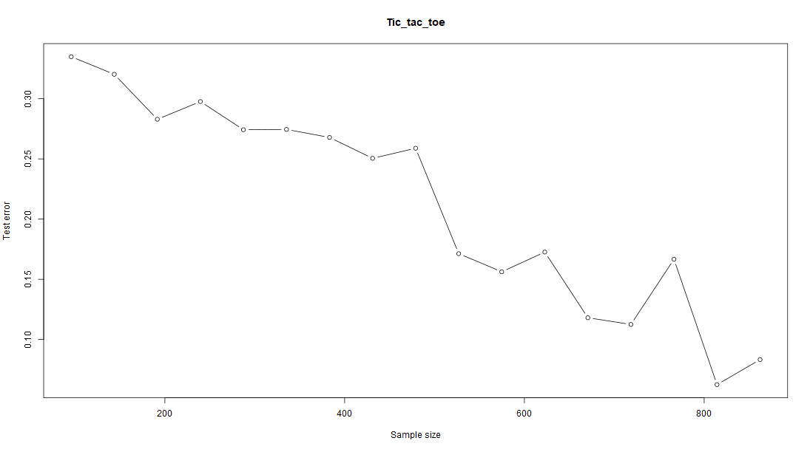
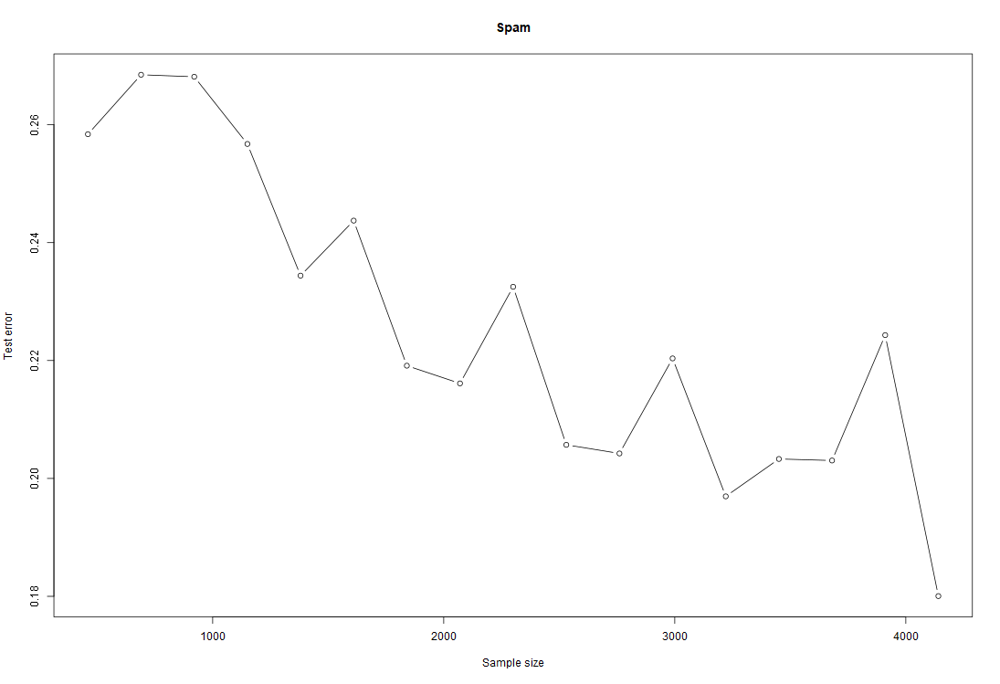
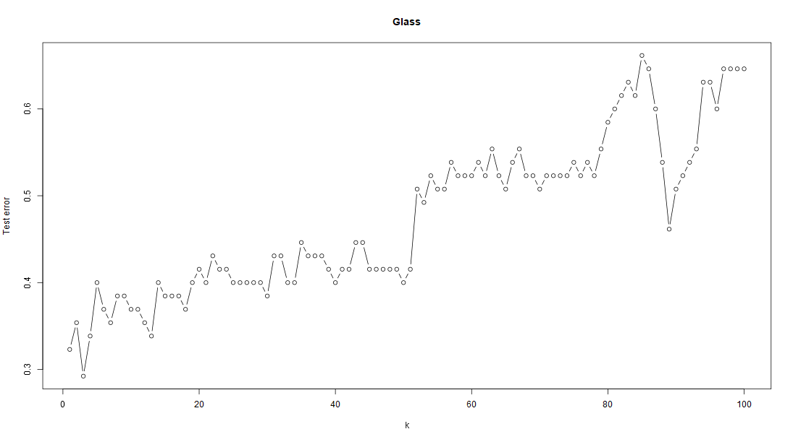
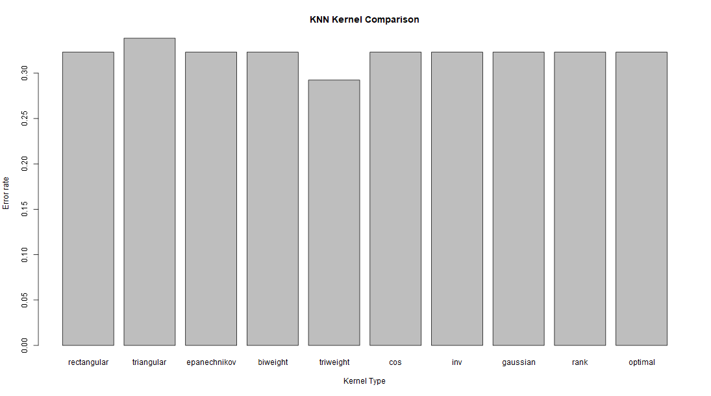
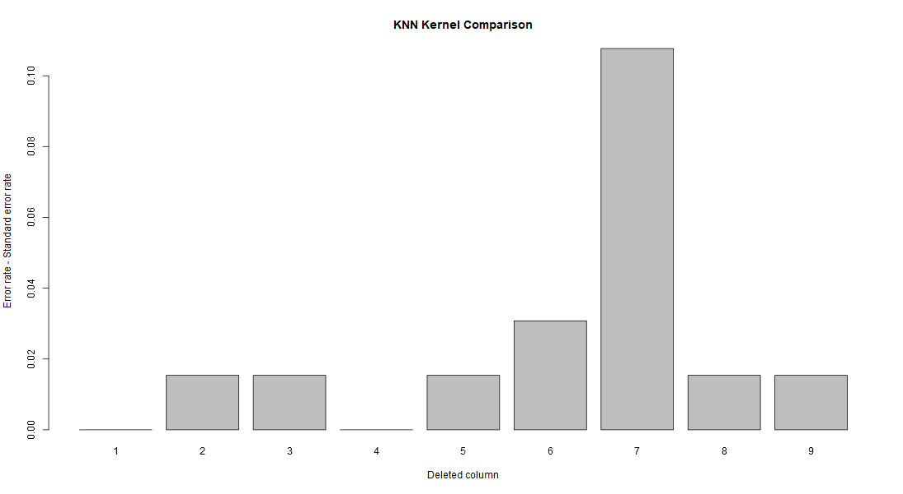

# KNN_lab
KNN_lab

## Work1




We can see that with increment of sample size, error rate decreases in both datasets.

## Work2


We can see that with increment of k, error rate increases.



The best kernel for the dataset is triweight.



If we delete the 7-th colmn - value of Ca content, the error rate will raise the most. So it means that Ca content has the greatest influence on the knn model for the set. Relatively, the content of Al and Ri does not have influence on the knn model.

With RI = 1.516, Na = 11.7, Mg = 1.01, Al = 1.19, Si = 72.59, K = 0.43, Ca = 11.44, Ba = 0.02, Fe = 0.1 we can get the output:
```
Predicted type: 4
```
It is most likely to be the glass for non-melt treated window.
